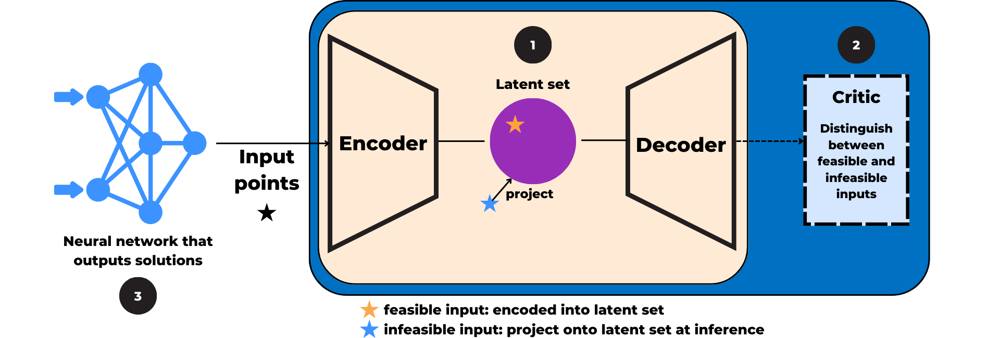

# Improving Feasibility via Fast Autoencoder-Based Projections

This repository is by 
[Maria Chzhen](https://www.linkedin.com/in/mariachzhen/) and 
[Priya L. Donti](https://www.priyadonti.com)
 and contains source code to reproduce the experiments in our paper 
 ["Improving Feasibility via Fast Autoencoder-Based Projections"](https://openreview.net/pdf?id=dVlkUtsyg7).

## Abstract
<p style="text-align: justify;">
Enforcing complex (e.g., nonconvex) operational constraints is a critical challenge in real-world learning and control systems. However, existing methods struggle to efficiently enforce general classes of constraints. To address this, we propose a novel data-driven amortized approach that uses a trained autoencoder as an approximate projector to provide fast corrections to infeasible predictions. Specifically, we train an autoencoder using an adversarial objective to learn a structured, convex latent representation of the feasible set. This enables rapid correction of neural network outputs by projecting their associated latent representations onto a simple convex shape before decoding into the original feasible set. We test our approach on a diverse suite of constrained optimization and reinforcement learning problems with challenging nonconvex constraints. Results show that our method effectively enforces constraints at a low computational cost, offering a practical alternative to expensive feasibility correction techniques based on traditional solvers.
</p>

<p align="center">
  
</p>

If you find this repository helpful in your publications, please consider citing our paper.
```bash
@article{chzhen2026fab,
    title={Improving Feasibility via Fast Autoencoder-Based Projections}, 
    author={Maria Chzhen and Priya L. Donti},
    year={2026},
    journal={The Fourteenth International Conference on Learning Representations},
}
```

## 🚀 Installation
Install dependencies:
```bash
pip install -r requirements.txt
```

## 🎓 Usage

### Constrained Optimization Problems
```bash
    python training.py [--shape SHAPE | --shapes_2d | --shapes_multidim]
                       [--exp_type {dim,cov,capacity,num_dec} [...]]
                       [--config CONFIG [...]]
                       [--lambda_recon FLOAT [...]]
                       [--lambda_feas FLOAT [...]]
                       [--lambda_latent FLOAT [...]]
                       [--lambda_geom FLOAT [...]]
                       [--lambda_hinge FLOAT [...]]
```

Shape selection (mutually exclusive; defaults to all 2D shapes if none given):
    --shape SHAPE           Run a single shape. Choices:
                                blob_with_bite, star_shaped, two_moons, concentric_circles,
                                hyperspherical_shell_3d, hyperspherical_shell_5d,
                                hyperspherical_shell_10d
    --shapes_2d             Run all 2D shapes (blob_with_bite, star_shaped, two_moons, concentric_circles)
    --shapes_multidim       Run all multidimensional shapes (hyperspherical_shell_3d/5d/10d)

Experiment configuration:
    --exp_type              One or more experiment types to run. Choices: dim, cov, capacity, num_dec
                            Default: all four types
    --config                Filter to specific config(s) within each exp_type. E.g.:
                                dim configs:      3D, 5D, 10D
                                cov configs:      Cov_10, Cov_25, Cov_50, Cov_75
                                capacity configs: W32_D2, W32_D4, W32_D6, W64_D2, W64_D4, W64_D6,
                                                  W128_D2, W128_D4, W128_D6
                                num_dec configs:  2_decoders
                            Default: all configs for each exp_type

Lambda overrides (each accepts one or more values; all combinations are swept in phase 2):
    --lambda_recon          Default: [1.5, 2.0]
    --lambda_feas           Default: [1.0, 1.5, 2.0]
    --lambda_latent         Default: [1.0, 1.5]
    --lambda_geom           Default: [0.025]
    --lambda_hinge          Default: [0.5, 1.0]

Examples:
    Run all 2D shapes across all experiment types:
    ```bash
    python training.py
    ```
    Single shape, single experiment type:
    ```bash
    python training.py --shape two_moons --exp_type capacity
    ```
    All multidimensional shapes, dim experiment only, specific configs:
    ```bash
    python training.py --shapes_multidim --exp_type dim --config 3D 5D
    ```
    Override lambda grid for a quick test:
    ```bash
    python training.py --shape blob_with_bite --exp_type cov --lambda_recon 1.5 --lambda_feas 1.0 --lambda_latent 1.0 --lambda_hinge 0.5
    ```
Output files follow the naming convention:
    phase1_{shape}_{exp_type}_{config}.pt
    phase2_{shape}_{exp_type}_{config}_{lambda_recon}_{lambda_feas}_{lambda_latent}_{lambda_geom}_{lambda_hinge}.pt

#### Testing Constrained Optimization Problems
```bash
    python testing.py [--shape SHAPE | --shapes_2d | --shapes_multidim]
                      [--exp_type {dim,cov,capacity,num_dec} [...]]
                      [--config CONFIG [...]]
                      [--models_dir DIR]
                      [--results_dir DIR]
                      [--output_csv FILE]
                      [--skip_latent_eval | --skip_experiments]
                      [--penalty_nn_only]
                      [--plot_sampling [--plot_models MODEL [...]] [--plot_dir DIR] [--plot_show]]
```

`testing.py` runs in two sequential phases by default:

**Phase 1 – Latent evaluation:** For each trained phase 2 model, samples from the latent ball and evaluates feasibility rate. Selects the best-performing model per shape/exp_type/config and writes results to a CSV (auto-named from the run tag, e.g. `optimal_ablation_params_all.csv`).

**Phase 2 – Experiments:** Reads the best-model CSV and benchmarks three methods — FAB end-to-end training, FAB post-hoc projection, and a penalty-based NN baseline — across QP, LP, and distance-minimization objectives. Results are saved to `results/` as a `.txt` summary and a `.pkl` file.

Shape / experiment / config flags are identical to `training.py`.

Options:
    --models_dir DIR        Directory containing trained .pt files. Default: ablations_trained_models
    --results_dir DIR       Output directory for experiment results. Default: results
    --output_csv FILE       Path for the best-model CSV. Default: auto-named from run tag
    --n_latent_samples N    Latent samples used per model for feasibility eval. Default: 500
    --latent_radius FLOAT   Radius of the latent ball. Default: 0.5
    --seed INT              Global random seed. Default: 42
    --skip_latent_eval      Skip Phase 1; use an existing output CSV directly for experiments
    --skip_experiments      Run Phase 1 only (latent eval + CSV generation)
    --penalty_nn_only       Run experiments with the penalty-NN baseline only; no AE models required
    --plot_sampling         Save latent-vs-decoded feasibility plots (2D shapes only)
    --plot_models MODEL     Restrict sampling plots to specific model(s) / shape:exp_type:config tags
    --plot_dir DIR          Output directory for sampling plots. Default: sampling_plots
    --plot_show             Display plots interactively in addition to saving

Examples:
    Run full pipeline on all 2D shapes (latent eval → experiments):
    ```bash
    python testing.py
    ```
    Skip latent eval and run experiments using an existing CSV:
    ```bash
    python testing.py --skip_latent_eval --output_csv optimal_ablation_params_all.csv
    ```
    Run only the penalty-NN baseline (no trained models required):
    ```bash
    python testing.py --penalty_nn_only
    ```
    Latent eval only with sampling plots for a single shape:
    ```bash
    python testing.py --shape two_moons --exp_type capacity --skip_experiments --plot_sampling
    ```

### Safe Reinforcement Learning Problems
Implementation borrowed from: [Safety-Gymnasium: A Unified Safe Reinforcement Learning Benchmark](https://github.com/PKU-Alignment/Safe-Policy-Optimization) (NeurIPS, 2023).

More information coming soon!